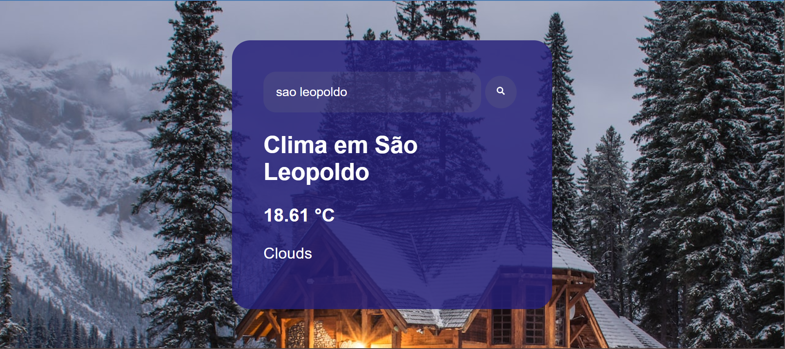
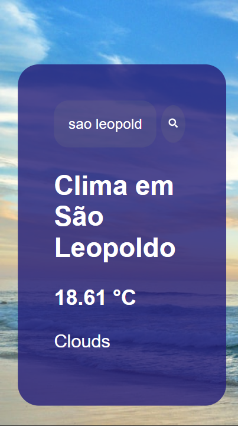

# Site-de-clima - Tarefa Unisinos parte 2

Um site de clima-tempo com consumo da api openweather utilizando React JS

## Versão Desktop

## Versão Mobile

### Demonstração

<a target="_blank" href="https://site-de-clima-react-js.vercel.app/">Clique aqui</a>
